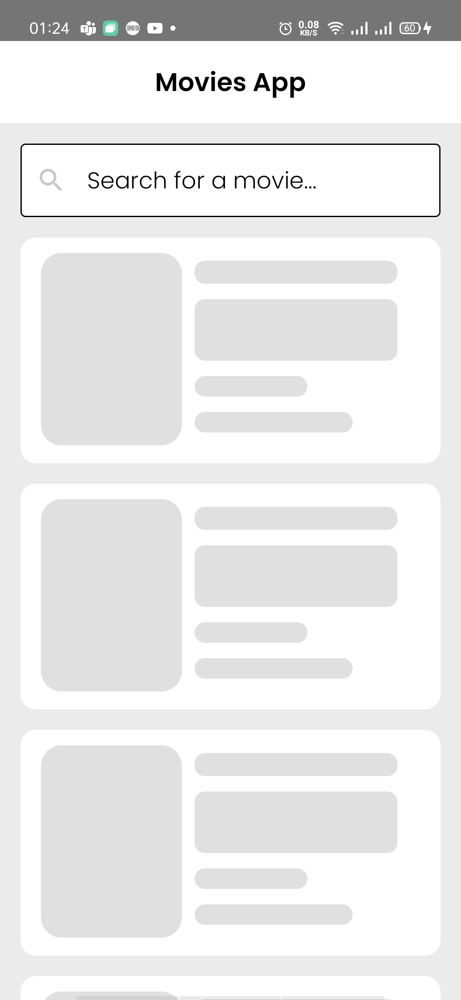
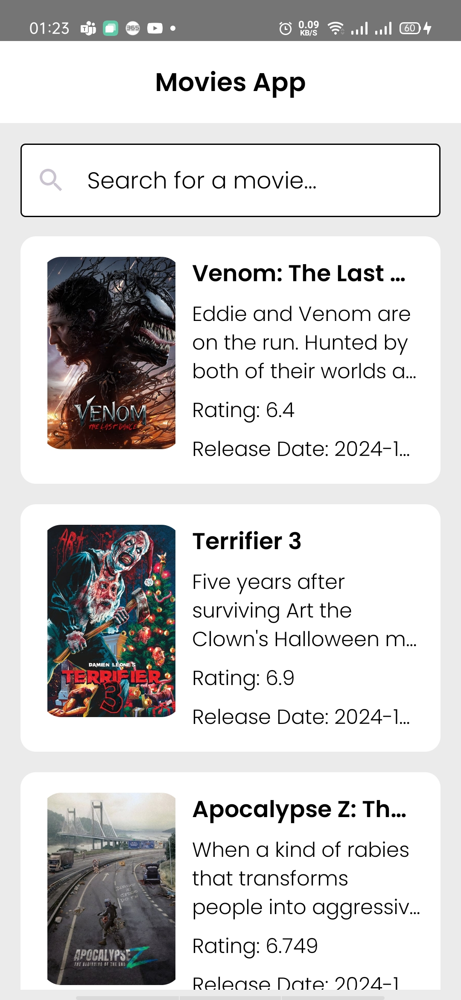
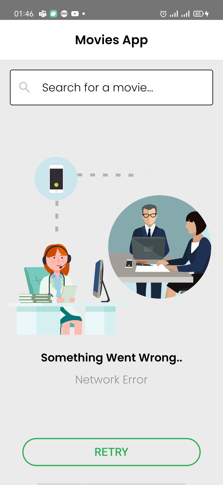
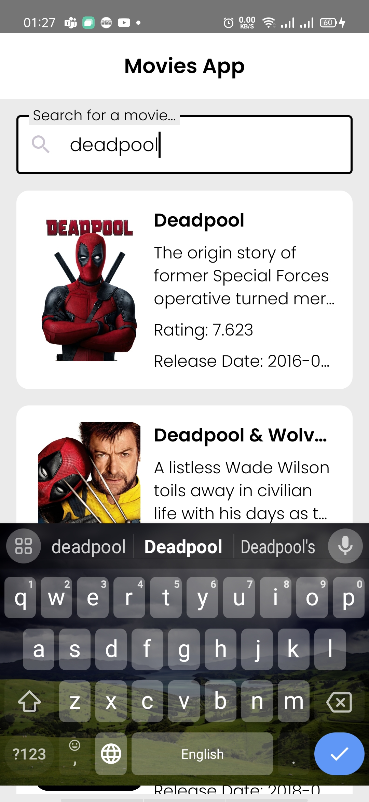
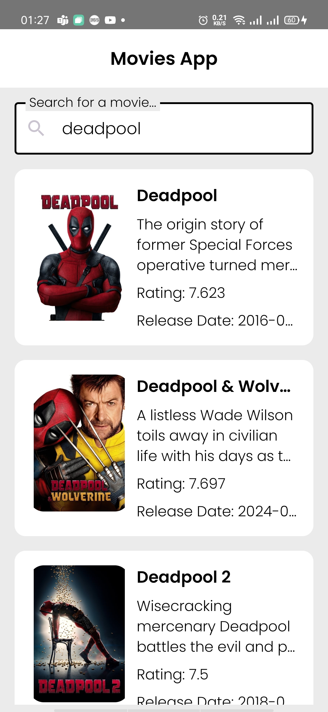
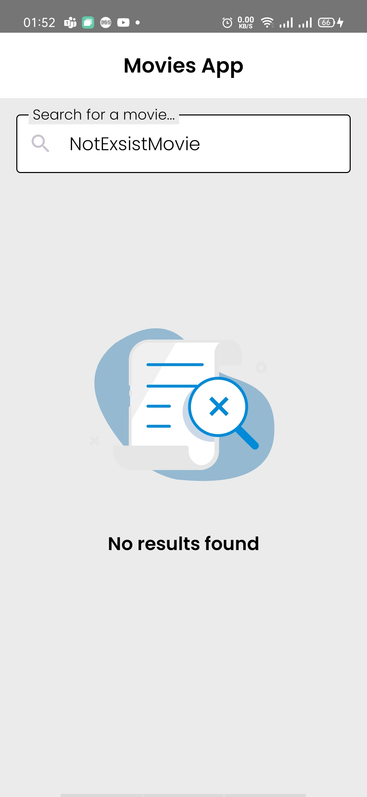
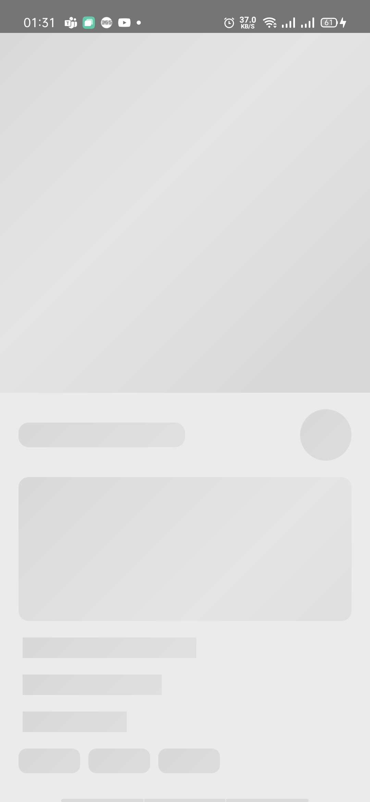
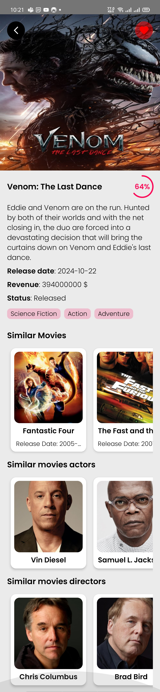
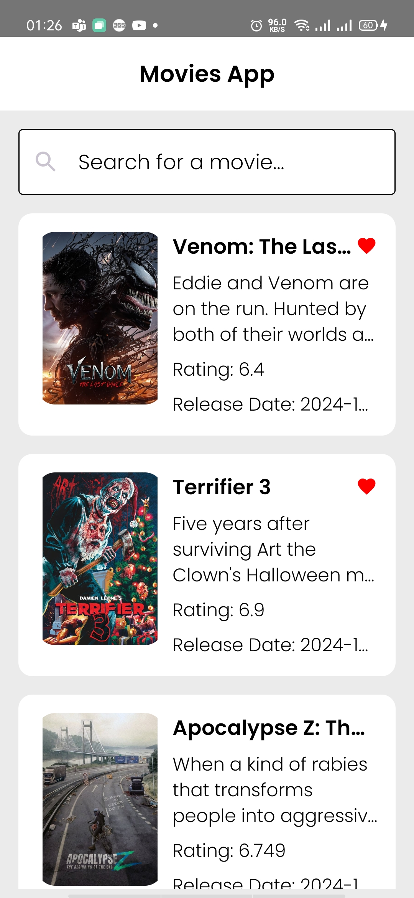

# Movies App 🎬 

• Welcome to the Movie Explorer App! This is a simple yet engaging movie discovery app that utilizes The Movie Database (TMDb) API to provide movie enthusiasts with a seamless experience of searching and exploring movies, viewing detailed information, and managing a watchlist. Enjoy exploring the world of movies!

# Features 📱 

• **Search Movies:** Allows users to search for movies by title and view popular movies when the search bar is empty.

• **Movie List:** Displays search results or popular movies grouped by release year, showing the movie title, overview, poster, and favorite status.

• **Movie Details:** Provides detailed information about a selected movie, including:
Movie title, overview, tagline, revenue, release date, status, and an option to add/remove from the favorite.

• **Similar Movies:** Shows up to 5 similar movies to the selected movie.

• **Top Casts:** Displays the top 5 actors and top 5 directors of similar movies, grouped by their departments and sorted by popularity.

# Technologies Used 🛠️ 

The app is built using modern Android development tools and practices, following the MVVM Clean Architecture pattern. Here's a breakdown of the technologies used:   

• Kotlin 
• Compose 
• MVVM Clean Architecture 
• Retrofit 
• OKHTTP3 
• Gson 
• Hilt 
• Coroutines 
• State Flow 
• Coil 
• ROOM 
• Chucker 
• Lottie Animation 
• Junit 
• Mockk 
• Turbine 

# Securing Api Key 👮🏻
• To secure the API key in this project, we used the BuildConfigField approach, which injects the API key during the build process. The key is stored securely in the local.properties file, which is not tracked by version control, and is injected into the app at build time. This avoids hardcoding the key directly into the source code, making it more secure.

Additional Security Options:

• **Encrypted SharedPreferences:** Securely stores sensitive data, such as API keys, on the device by encrypting it before storing it. However, it can still be accessed if the device is compromised.

• **NDK (Native Development Kit):** Stores sensitive data in native C++ code, making it more difficult to reverse-engineer. It offers an added layer of security but is not entirely foolproof against skilled attackers.

# Supported Android Version ℹ
• Android 9 (Api 28) and above

# Test Coverage 🧪

This project includes comprehensive **unit tests** and **UI tests** to ensure the robustness and reliability of the application:

• **Unit Tests**  
Implemented unit tests for almost all features and scenarios of the application.
These tests cover core business logic, data transformations, and edge cases to ensure the app behaves as expected across different use cases.

• **UI Tests**  
The project also includes extensive UI test cases for the Home Screen using Jetpack Compose Testing.
These tests validate various UI elements and interactions such as:

• Display of popular movie items, including titles and posters.

• Visibility of favorite icons for favorite movies.

• Proper handling of different UI states like loading, error, and empty states.

• Search functionality and input handling in the search bar.

By covering both unit and UI testing, we aim to provide a reliable user experience and maintain the app's quality over time.

# Future Enhancements 🚀
• Implement pagination for popular movie lists and search results.  
• Implement dark mode for a better user experience.

# Screen Shots 🖼

 
 

 
 

 
 
